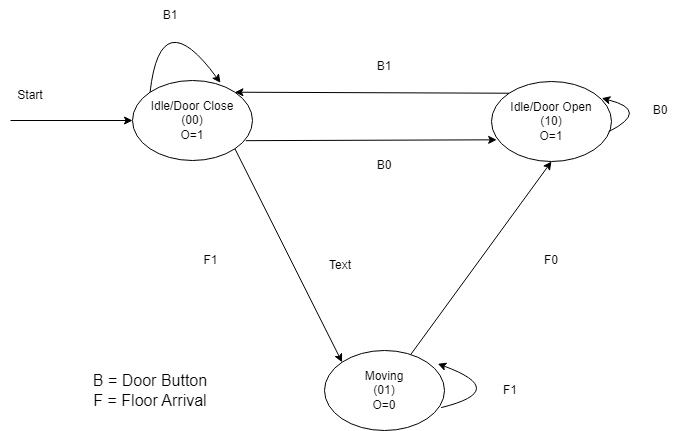
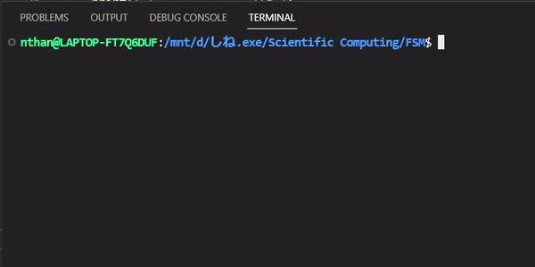

# FSM
Carlo Nathanael Bessie
L1BC
2602236685

## Finite State Machine
A finite state machine is a "machine" or process that has a finite number of states and rules dictating when the machine moves from one state to the other.

## Elevator System
The system is an elevator system circuit that receive inputs from button inputs. The states that are present for this fsm system are idle/closed (00), idle/opened(10), and moving(01). There are two different buttons that produce inputs to the elevator. The first button is the door button where if it pressed(B0) will open the elevator and if it is pressed again(B1), it will close the elevator. The second button is the move button where if it pressed(F1), it will move the elevator and if it arrived on a floor, it will reset the button(F0).

### FSM Diagram:

### State and Transition table:

### Karnaugh Map:

#### S'0

#### S'1

#### Output

## Visualisation
### Running the code

- ### Closed (00)

- ### Moving (01)

- ### Opened (10)

